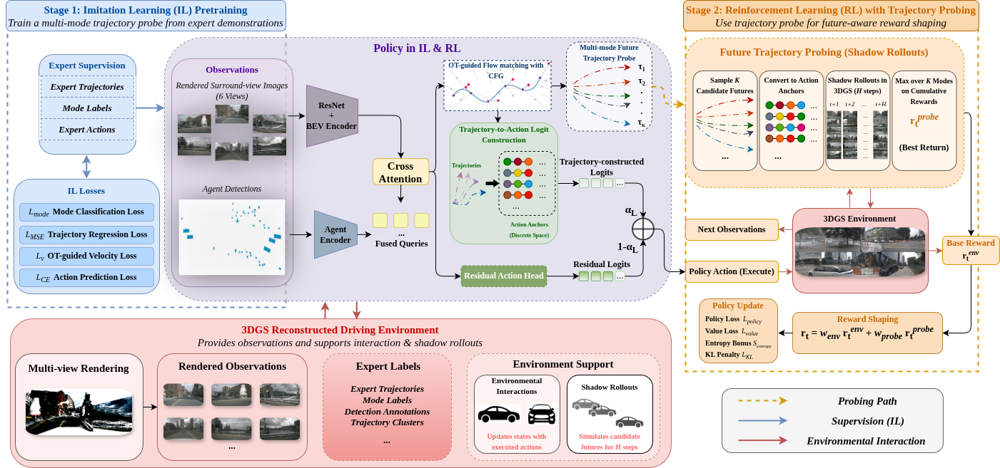

<div align="center">

# GSDrive: Reinforcing Driving Policies by Multi-mode Future Trajectory Probing with 3D Gaussian Splatting Environment

[Paper](https://arxiv.org/abs/2604.28111)

</div>

## Abstract
End-to-end (E2E) autonomous driving aims to directly map sensory observations to driving actions, but its real-world deployment is hindered by evolving data distributions and the high cost of continual annotation. While combining imitation learning (IL) and reinforcement learning (RL) is a common strategy for policy improvement, conventional RL training relies on delayed, event-based rewards, where policies learn only from catastrophic outcomes such as collisions, leading to premature convergence to suboptimal behaviors. To address these limitations, we propose GSDrive, a framework that uses a differentiable 3D Gaussian Splatting (3DGS) environment for future-aware trajectory probing and reward shaping in E2E driving. GSDrive first learns a multi-mode trajectory probe via IL and then uses RL to evaluate multiple candidate futures in the 3DGS environment, converting their simulated returns into dense shaping rewards for policy optimization. This yields a cyclic hybrid IL-RL training loop, where IL supplies structured future priors and RL provides interactive feedback for iterative refinement. Evaluated on the reconstructed nuScenes dataset, our method outperforms other simulation-based RL approaches in closed-loop experiments.

<div align="center">
  
  <p><em>Overall architecture of GSDrive.</em></p>
</div>

## Environment Preparation
```bash
# 1. Create and activate a conda environment
conda create -n gsdrive python=3.10 -y
conda activate gsdrive

# 2. Install PyTorch (example for CUDA 12.1)
pip install torch torchvision torchaudio --index-url https://download.pytorch.org/whl/cu121

# 3. Install remaining dependencies
pip install -r requirements.txt

# 4. Install third-party renderers (required for the reconstruction simulator)
cd assets/third/gsplat-1.3.0 && pip install -e . && cd -
cd assets/third/nvdiffrast-0.3.0 && pip install -e . && cd -
```

## Dataset
This project is based on [ReconDreamer-RL](https://github.com/GigaAI-research/ReconDreamer-RL). Download the dataset from [huggingface](https://huggingface.co/datasets/ydcttt/ReconDreamer-RL/tree/main/assets/nus).

Place the downloaded dataset into the corresponding sub-folder `./assets/nus/` for running this code.

## Training (`train.py`)
`train.py` implements a **two-stage** training pipeline:

1. **Imitation Learning (IL) — `train_bc`**
   Behavior-cloning warm-up.

2. **Reinforcement Learning (RL) — `train_ppo`**
   Loads the trained checkpoint as initialization and fine-tunes in the 3DGS environment (`env.py`).

Run with:
```bash
python train.py
```

## Citation
```bibtex
@article{guo2026gsdrive,
  title={GSDrive: Reinforcing Driving Policies by Multi-mode Future Trajectory Probing with 3D Gaussian Splatting Environment},
  author={Guo, Ziang and Min, Chen and Zhang, Xuefeng and Zhou, Yixiao and Wang, Shuo and Zheng, Sifa and Tsetserukou, Dzmitry and Zhang, Zufeng},
  journal={arXiv e-prints},
  pages={arXiv--2604},
  year={2026}
}
```

## Acknowledgement
GSDrive is inspired by the following codebase:

[RAD](https://github.com/hustvl/RAD)

[ReconDreamer-RL](https://github.com/GigaAI-research/ReconDreamer-RL)

[DiffusionDrive](https://github.com/hustvl/DiffusionDriveV2)

We acknowledge their great work.
